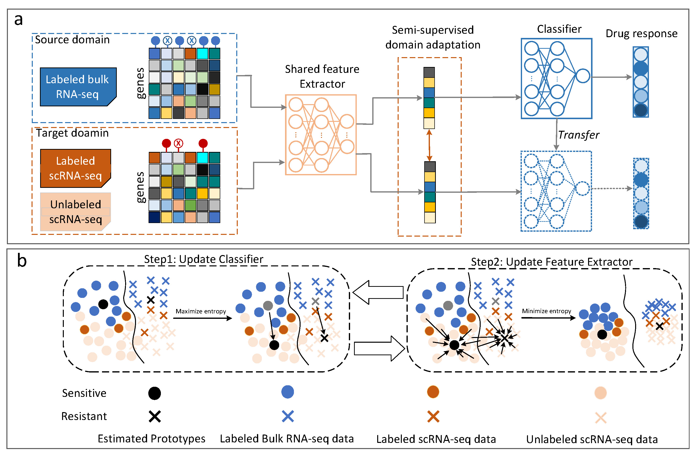

# Semi-supervised deep transfer learning accurately predicting single-cell drug responses

## Introduction

**SSDA4Drug** is a deep learning framework that leverages semi-supervised domain adaptation techniques to translate drug response knowledge from source domain to the target domain. Also, adversarial training is introduced to reduce the model's sensitivity to slight input variations, thereby enhance its generalizability. SSDA4Drug not only reduces the distribution gap between domains but also learns discriminative features specific to the classification task.

## Model Architecture



## Requirements

The deep learning models were trained using 2*NVIDIA GeForce RTX 4090 on Linux system.

+ Python 3.9
+ PyTorch 2.1.0
+ Pandas 2.0.3
+ Numpy 1.24.3
+ Scikit-learn 1.3.1
+ Scanpy 1.9.5
+ Shap 0.45.1
+ Captum 0.7.0

## Installation Guide

```
1.Clone the SSDA4Drug repository
```

` git clone https://github.com/hliulab/SSDA4Drug.git`

```
2.Enter SSDA4Drug project folder
```

` cd SSDA4Drug/`

```
3.Set up the Python environment and install the required packages
```

`conda create --name <your_env_name> --file requirements.txt`

## Usage

If you want to use the benchmark dataset to train a baseline model, please split the dataset into training and validation sets:

```bash
benchmark.ipynb
split_data.ipynb
n_shot.ipynb
```
Once the benchmark dataset has been processed, you can run SSDA4Drug using the command:
```bash
python experiment_shot.py --shot_method "3-shot" --drug "Gefitinib" --encoder_h_dims "512,256" --bottleneck 128 --predictor_h_dims "64,32" --epochs 50 --lr 0.001 --batch_size 32 --dropout 0.3
```

if you want to train the model using custom datasets, you need to download the datasets (Example: GDSC and GEO), place it in the datasets folder, and then run
```bash
python experiment_shot.py --shot_method "3-shot"
```

Usage of other competing models

- `baseline`: 
  - `1. cd benchmark/baseline/`
  - `2. python baseline.py --drug "Gefitinib"`

- `CODE-AE`:
  - `1. cd benchmark/CODEAE/`
  - `2. python pretrain_hyper_main.py --drug "Gefitinib"`
  - `3. python drug_ft_hyper_main.py --drug "Gefitinib"`

- `SCAD`:
  - `1. cd benchmark/SCAD`
  - `2. python main.py --drug "Gefitinib"`

- `scDeal`:
  - `1. cd benchmark/scDeal/`
  - `2. python bulkmodel.py --drug "Gefitinib"`
  - `3. python scmodel.py`

- `scDeal_noPre`:
  - `1. cd benchmark/scDeal/`
  - `2. python scmodel_noPre.py --drug "Gefitinib"`

Running extended experiments with SSDA4Drug

`cell_name` :`Choose the experiment you want to run, including PC9,PCa,MCF7 or OSCC.`

```bash
python experiment.py --cell <cell_name>
```

## Directory structure

+ `experiment_shot.py`: The code for the model, the dataset, the evaluation, and the training loop.
+ `trainer.py`: The training loop, the hyper-parameters, and the evaluation.
+ `utils.py`: Contains auxiliary, general-purpose, or custom functions, which can be called and used in other parts of the project.
+ `model.py`: Model storage directory.
+ `Benchmark`:
  - `baseline`:The code for the baseline model, the evaluation, and the training loop.
  - `CODEAE`: The code for the `CODEAE` model, the evaluation, and the training loop.
  - `SCAD`: The code for the `SCAD` model, the evaluation, and the training loop.
  - `scDeal`: The code for the `scDeal` model, the evaluation, and the training loop.
+ `Extended`:
  - `MCF7`: The processed dataset of MCF7 cell lines.
  - `OSCC`: The processed  dataset of OSCC cell lines.
  - `PC9`: The processed  dataset of PC9 cell lines.
  - `PCa`: Te processed  dataset of PCa cell lines.
+ `Datasets`:
  * `rawData`: The benchmark datasets used for performance comparison.
  * `benchmark.ipynb`: Separating expression profiles and labels from the raw benchmark dataset.
  * `split_data.ipynb`: Spliting the dataset.
  * `n-shot.ipynb`: Extracting labeled samples from each class in the target domain.
